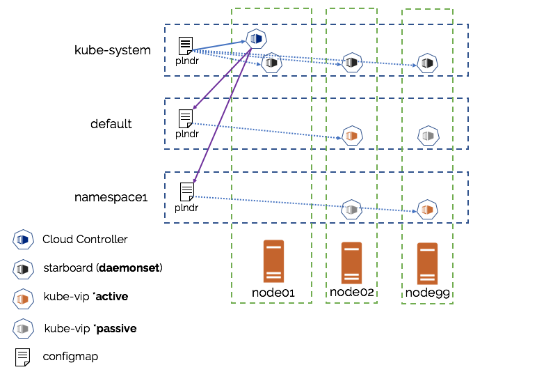

# **kube-vip** architecture

This section covers two parts of the architecture: 

1. The technical capabilities of `kube-vip`
2. The components to build a load-balancing service within [Kubernetes](https://kubernetes.io)

The `kube-vip` project is designed to provide both a highly available networking endpoint and load-balancing functionality for underlying networking services. The project was originally designed for the purpose of providing a resilient control-plane for Kubernetes, it has since expended to provide the same functionality for applications within a Kubernetes cluster.

Additionally `kube-vip` is designed to be lightweight and **multi-architecture**, all of the components are built for Linux but are also built for both `x86` and `armv7`,`armhvf`. This means that `kube-vip` will run fine in **bare-metal**, **virtual** and **edge** (raspberry pi or small arm SoC devices). 

## Technologies

There are a number of technologies or functional design choices that provide high-availability or networking functions as part of a VIP/Load-balancing solution.

### Cluster

The `kube-vip` service builds a multi-node or multi-pod cluster to provide High-Availability. When a leader is elected, this node will inherit the Virtual IP and become the leader of the load-balancing within the cluster. 

When running **out of cluster** it will use [raft](https://en.wikipedia.org/wiki/Raft_(computer_science) clustering technology 

When running **in cluster** it will use [leader election](https://godoc.org/k8s.io/client-go/tools/leaderelection)

### Virtual IP

The leader within the cluster will assume the **vip** and will have it bound to the selected interface that is declared within the configuration. When the leader changes it will evacuate the **vip** first or in failure scenarios the **vip** will be directly assumed by the next elected leader.

When the **vip** moves from one host to another any host that has been using the **vip** will retain the previous `vip <-> MAC address` mapping until the ARP (Address resolution protocol) expires the old entry (typically 30 seconds) and retrieves a new `vip <-> MAC` mapping. This can be improved using Gratuitous ARP broadcasts (when enabled), this is detailed below.

### ARP

(Optional) The `kube-vip` can be configured to broadcast a [gratuitous arp](https://wiki.wireshark.org/Gratuitous_ARP) that will typically immediately notify all local hosts that the `vip <-> MAC` has changed.

**Below** we can see that the failover is typically done within a few seconds as the ARP broadcast is recieved.

```
64 bytes from 192.168.0.75: icmp_seq=146 ttl=64 time=0.258 ms
64 bytes from 192.168.0.75: icmp_seq=147 ttl=64 time=0.240 ms
92 bytes from 192.168.0.70: Redirect Host(New addr: 192.168.0.75)
Vr HL TOS  Len   ID Flg  off TTL Pro  cks      Src      Dst
 4  5  00 0054 bc98   0 0000  3f  01 3d16 192.168.0.95  192.168.0.75 

Request timeout for icmp_seq 148
92 bytes from 192.168.0.70: Redirect Host(New addr: 192.168.0.75)
Vr HL TOS  Len   ID Flg  off TTL Pro  cks      Src      Dst
 4  5  00 0054 75ff   0 0000  3f  01 83af 192.168.0.95  192.168.0.75 

Request timeout for icmp_seq 149
92 bytes from 192.168.0.70: Redirect Host(New addr: 192.168.0.75)
Vr HL TOS  Len   ID Flg  off TTL Pro  cks      Src      Dst
 4  5  00 0054 2890   0 0000  3f  01 d11e 192.168.0.95  192.168.0.75 

Request timeout for icmp_seq 150
64 bytes from 192.168.0.75: icmp_seq=151 ttl=64 time=0.245 ms
```

### Load Balancing

Within a Kubernetes cluster, the load-balancing is managed by the `plndr-cloud-provider` which watches all service that are created, and for those of `type: LoadBalancer` will create the configuration for `kube-vip` to consume.

#### Load Balancing (Outside a cluster)

Within the configuration of `kube-vip` multiple load-balancers can be created, below is the example load-balancer for a Kubernetes Control-plane:

```
loadBalancers:
- name: Kubernetes Control Plane
  type: tcp
  port: 6443
  bindToVip: true
  backends:
  - port: 6444
    address: 192.168.0.70
  - port: 6444
    address: 192.168.0.71
  - port: 6444
    address: 192.168.0.72
```

The above load balancer will create an instance that listens on port `6443` and will forward traffic to the array of backend addresses. If the load-balancer type is `tcp` then the backends will be IP addresses, however if the backend is set to `http` then the backends should be URLs:

```
  type: http
  port: 6443
  bindToVip: true
  backends:
  - port: 6444
    address: https://192.168.0.70
```

Additionally the load-balancing within `kibe-vip` has two modes of operation:

`bindToVip: false` - will result in every node in the cluster binding all load-balancer port(s) to all interfaces on the host itself

`bindToVip: true` - The load-balancer will only **bind** to the VIP address.


## Components within a Kubernetes Cluster

The `kube-vip` kubernetes load-balancer requires a number of components in order to function:

- The Plunder Cloud Provider -> [https://github.com/plunder-app/plndr-cloud-provider](https://github.com/plunder-app/plndr-cloud-provider)
- The Starboard Daemonset -> [https://github.com/plunder-app/starboard](https://github.com/plunder-app/starboard)
- The Kube-Vip Deployment -> [https://github.com/plunder-app/kube-vip](https://github.com/plunder-app/kube-vip)

### Architecture overview



### Plunder Cloud Provider

The cloud provider works like all Kubernetes cloud providers and is built using the Kubernetes cloud-provider SDK. It's role is to provide the same cloud "like" services one would expect from services such as AWS / Azure / GCP etc.. in that when a user requests functionality then the cloud provider can speak natively to the underlying vendor and provision the required service 

e.g. _In AWS when requesting a Kubernetes LoadBalancer, the cloud provider will provision an **ELB**_ 

The `Plunder cloud Provider` is *currently* only designed to intercept the creation of LoadBalancers and translate that into a `kube-vip` load balancer. 

It is configured by a `configMap` within the `kube-system` namespace that contains the ranges of addresses that the other `kube-vip` load-balancers can use, it will also manage the allocation of addresses and then build the configMap configurations in these namespaces for consumption by `kube-vip`. The IP addresses for each namespace should be in the structure `cidr-<namespace>` followed by the cidr range for the address pool.

**Example `ConfigMap`**

```
apiVersion: v1
kind: ConfigMap
metadata:
  name: plndr
  namespace: kube-system
data:
  cidr-default: 192.168.0.200/29
  cidr-plunder: 192.168.0.210/29
  cidr-testing: 192.168.0.220/29
``` 

### Starboard Daemonset

The `starboard` pod is a simple service that implements a [client-go](https://github.com/kubernetes/client-go) [watch](https://github.com/plunder-app/starboard/blob/master/main.go#L72) on a Kubernetes `configMap` that contains the network range/cidr that load-balancer addresses will use. It then ensures that this cidr is present in the ipTables of all machines in the cluster, this will ensure that network traffic is directed to `kube-vip` to be load-balancer to the underlying application pods.

### Kube-vip

 The `kube-vip` pod should exist in every namespace that requires load-balancing services, it also implements a "client-go watch" over a `configMap` in its current namespace. These configurations and created and managed by the cloud-provider, when `kube-vip` sees a change happen (i.e. a new service is defined) then it will implement the virtual IP and start the load-balancer. Furthermore `kube-vip` implements a second "watch" over the endpoints of the service and as that service changes (pods die, scaling etc..) so will the the endpoints that `kube-vip` will load-balancer over. 
