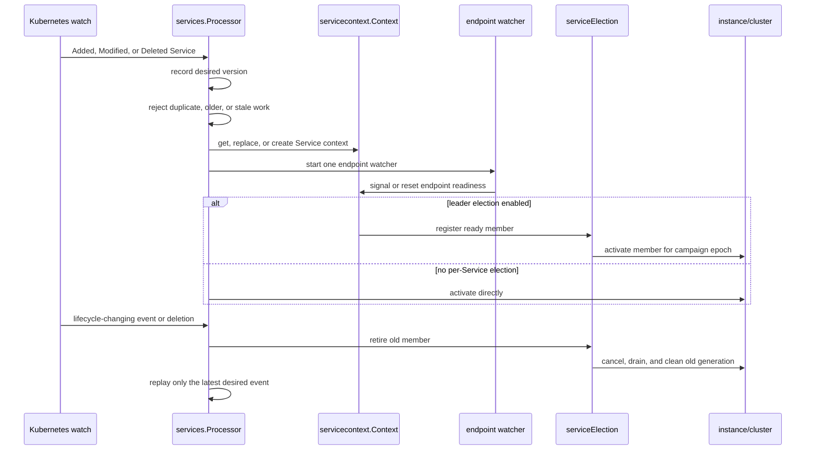
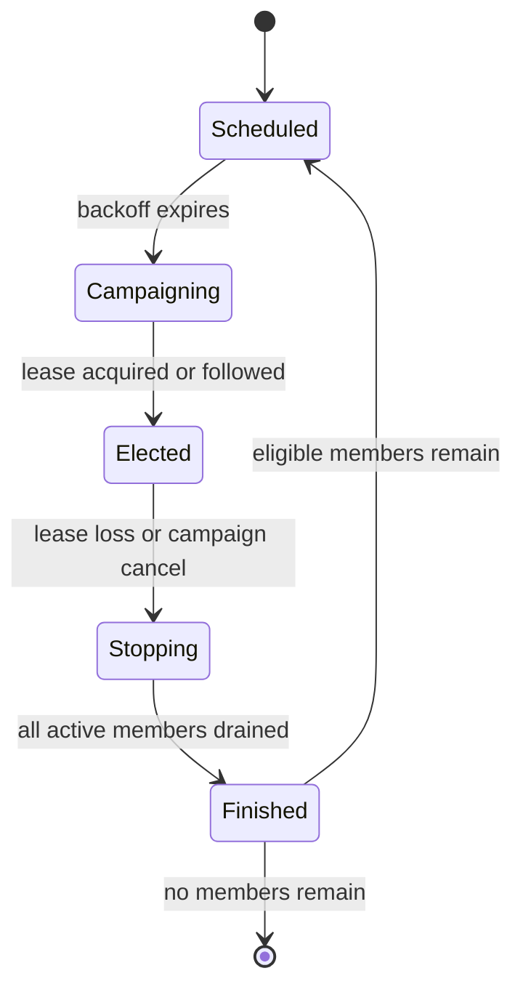

# Service lifecycle architecture

This document describes the service lifecycle implemented across
`pkg/services`, `pkg/servicecontext`, `pkg/endpoints`, `pkg/cluster`, and the
WireGuard integration. It is aimed at maintainers changing reconciliation,
leader election, or network cleanup. The central constraint is simple:

> An old Service, endpoint, election, or worker generation must never activate
> or delete resources owned by a newer generation.

## Component ownership

| Component | Responsibility |
| --- | --- |
| `services.Processor` | Desired Service state, Service contexts, instances, reconciliation, shared-resource locks, and election coordinators |
| `servicecontext.Context` | One Service lifetime, endpoint readiness generations, watcher ownership, and leader-loop ownership |
| `endpoints.Processor` | Endpoint object aggregation, readiness transitions, annotations, and mode-specific datapath reconciliation |
| `serviceElection` | One lease coordinator and every Service member sharing that lease |
| `instance.Instance` | The applied Service snapshot, VIP configuration, clusters, VLAN/DHCP state, and associated network state |
| `cluster.Cluster` | Cluster-level VIP, ARP/NDP, BGP, route, and DNS workers across successive generations |
| `lease.Manager` | Reference-counted local lease registrations and claims |
| `wireguard.TunnelManager` | Per-VIP tunnel configuration and tunnel lifetime |

The Kubernetes Service UID is the reconciliation identity. Namespace/name is
used for Kubernetes lookups and lease names, but cannot identify a lifetime: a
deleted Service may be recreated with the same namespace/name and a new UID.

## End-to-end flow



## Desired-state ordering

Every owned watcher event enters `Processor.Reconcile`, which records it before
performing external work. `desiredEvent` stores:

- a monotonically increasing local version;
- the Kubernetes event type and `resourceVersion`;
- a deep copy of the desired Service;
- the lifecycle fields used to decide whether replacement is required;
- the previous lifecycle when a meaningful change has not yet been applied.

The lifecycle snapshot includes the UID and Service type; external and internal
traffic policies; IP families and family policy; ports; load-balancer class and
node-port allocation policy; source ranges; traffic distribution; addresses;
hostnames; and kube-vip annotations that affect the datapath or ownership.

`recordDesiredEvent` has four important rules:

1. Exact duplicates retain their version. This matters because forced and
   non-forced watchers can observe the same Kubernetes event.
2. Numerically older Kubernetes `resourceVersion` values are ignored.
3. A meaningful lifecycle change increments the local version.
4. deletion and a transition away from `LoadBalancer` create terminal versions.

Terminal versions are bounded tombstones. They prevent an in-flight activation
from committing after deletion without retaining every deleted UID forever.

External mutation is guarded by `desiredEventCurrent`,
`desiredLifecycleCurrent`, or a `serviceExpectation`. An activation checks its
expectation before construction, before publication, and during election
activation. If it becomes stale after allocating resources, synchronous cleanup
uses `context.WithoutCancel` so the cancellation that made it stale cannot also
interrupt rollback.

### Desired-state invariants

- A stale version cannot publish an instance.
- A terminal version cannot activate a VIP.
- Retained Service objects are deep copies.
- A replacement cannot reuse a cancelled Service context.
- Only the newest coalesced pending event is replayed after cleanup.

## Service contexts and endpoint generations

A `servicecontext.Context` represents one Service lifetime and has a stable
watcher parent:

```text
watcher context
    `-- Service context
         |-- endpoint watcher
         `-- long-lived election member loop
```

It is deliberately not parented to a lease context. Lease loss ends one
campaign; it must not destroy endpoint state or the Service lifetime needed to
start the next campaign.

Endpoint readiness is generation-scoped. Each generation has two channels:

```text
generation N
    ready  closed when usable endpoints exist
    lost   closed when that exact endpoint generation is superseded
```

`SignalReadiness` closes `ready` once. `ResetReadiness` closes the old `lost`
channel, creates fresh `ready` and `lost` channels, and clears `Signalled` under
one mutex. Code waiting on an old generation therefore cannot mistake recovery
of a later generation for readiness of the old one.

The context also serializes two independent owners:

- `StartWatching` / `StopWatching` allow one endpoint watcher;
- `StartLeaderLoop` / `FinishLeaderLoop` allow one election member loop.

`CancelLeader` is safe before, during, or after callback installation. A pending
cancellation is remembered and applied when `SetLeaderCancel` installs the
callback.

## Reconciliation and replacement

`reconcileDesired` performs the following sequence:

1. Confirm watcher ownership and the desired version.
2. Delete a tracked instance for a terminal Service.
3. Wait for an allocated address when Kubernetes has not supplied one yet.
4. Load the Service context and detect pending cleanup.
5. Compare the desired lifecycle with the coordinator or instance snapshot.
6. Drain an old election member before replacing its context.
7. Create the new context and local lease registration.
8. Construct an instance under Service and shared-resource locks when direct
   activation requires one.
9. Start the optional Service callback and endpoint watcher.
10. Mark the lifecycle applied after the callback/watcher goroutine is launched.
    Watch creation and runtime failures are reported asynchronously by that
    goroutine and cancel the Service context when necessary.

For a lifecycle-changing `Modified` event, cleanup precedes replacement:

```text
old desired version
  -> mark old member removing
  -> cancel old Service context
  -> drain activation and workers
  -> retire old lease claim
  -> remove old svcMap entry
  -> replay latest desired version
```

When cleanup is still running, `pendingReconcile` stores one event per Service
UID. A newer event for the same retiring member replaces the stored event.
`cleanupGroup` prevents replay after watcher shutdown and joins asynchronous
cleanup before `ServicesWatcher` returns.

The internal election watcher marks its callback with
`skipEndpointReconcile`. This explicit role prevents the endpoint processor from
recursively starting the same coordinator callback. Public callbacks remain
eligible for endpoint-driven restart.

## Endpoint processing

`watchEndpoint` selects the Endpoints or EndpointSlice provider, starts a retry
watcher, and debounces events. `endpoints.Processor.Reconcile` then runs under
the Service UID lock:

1. Apply or delete the individual provider object.
2. Recompute all remaining endpoints.
3. Update endpoint status on the instance.
4. Enforce the requested endpoint address family.
5. Start Service handling when required.
6. Signal or reset the readiness generation.
7. Run the mode-specific endpoint worker when `shouldProcessInstance` assigns
   datapath work to this node and mode.
8. Persist active-endpoint annotations and update egress.

Deleting one EndpointSlice removes only that slice's contribution. It does not
imply that the Service has no endpoints.

With no usable endpoints, the processor resets readiness, clears mode-specific
state, and drains ARP or routing workers where required. The Service context
stays alive so endpoint recovery can reuse the watcher and begin a new readiness
generation. Endpointless activation is allowed only through the explicit
`AllowReconcileWithoutEndpoints` opt-in.

## Election coordinator

A `serviceElection` is keyed by lease ID rather than Service UID. This is what
allows multiple Services using the same configured lease to share one campaign
without sharing their individual lifetimes.

```text
serviceElection (lease ID)
    |-- campaign epoch N
    |-- member: Service UID A / readiness generation A1
    `-- member: Service UID B / readiness generation B3
```

An `electionMemberKey` contains an exact local claim, Service-context pointer,
and readiness-loss channel. A delayed callback from an older Service or endpoint
generation therefore cannot match the replacement member.

The member loop waits for readiness, registers a claim, and follows coordinator
state. When elected, each eligible member gets a cancellable activation context
whose parent is derived with `context.WithoutCancel` from the Service context.
Explicit watchers invoke that child cancel function to translate Service
cancellation, readiness loss, or campaign stop into an ordered
prepare-and-cancel operation.

### Campaign states



Campaign epochs distinguish late callbacks from the current campaign. An old
epoch cannot mark the coordinator elected or stop a replacement campaign.

On campaign stop, the coordinator:

1. clears elected state and marks the campaign stopping;
2. snapshots active members and instances;
3. computes address ownership and preservation for the whole stop set;
4. publishes the prepared stop data;
5. cancels member activation contexts;
6. waits until every active or cleaning member is drained;
7. closes the campaign and schedules a bounded-backoff successor if needed.

A member leaving does not cancel a shared campaign while eligible siblings
remain. The final member cancels the campaign and permits coordinator removal.

### Cleanup and retry

Member cleanup cancels activation, waits for its activation workers, deletes the
instance with the prepared ownership information, and retires its lease claim.
Transient cleanup failures receive a small synchronous retry budget, followed
by a watcher-scoped asynchronous retry. Watcher shutdown closes admission to new
cleanup workers, joins existing workers, and returns joined cleanup errors.

No successor campaign is allowed to complete startup while the old campaign
still has active or cleaning members.

## Locking model

The architecture uses narrow locks for identity and wider locks only for shared
network resources.

| Lock | Protects |
| --- | --- |
| `desiredMu` | Desired versions, lifecycle snapshots, and tombstones |
| Service UID lock | One Service's context and instance mutation |
| `instancesMutex` | The instance slice itself |
| `networkLifecycle` | Shared/exclusive hostname-driven network construction |
| keyed resource locks | Service name, VIP, hostname, VLAN, and DHCP resources |
| `electionsMu` | The lease-ID-to-coordinator map |
| coordinator mutex | Members, campaign, epoch, and coordinator transitions |
| `metricsMu` | Reset-and-rebuild of active-Service metrics |

Resource keys are sorted, deduplicated, acquired in lexical order, and released
in reverse. Hostname-backed construction takes the exclusive
`networkLifecycle` lock because DNS can resolve to resources not known before
construction; static resources use its shared lock.

The required election order is:

```text
Service UID lock -> electionsMu -> coordinator mutex
```

Coordinator code must not acquire a Service UID lock while holding the
coordinator mutex. It captures state, releases the coordinator, and performs
Service or network work. Activation receives a `serviceExpectation` whose
validity checks reject stale member, context, readiness, lifecycle, or campaign
state before publication.

The required network order is:

```text
Service UID lock -> networkLifecycle -> sorted keyed resource locks
```

`instancesMutex` protects membership of the slice, not mutable fields inside an
instance. Instance field mutation remains serialized by its Service UID lock.

## Instance and worker generations

An instance owns one or more `cluster.Cluster` values. Each cluster publishes at
most one `workerGeneration` containing:

- `stop`, closed once to request shutdown;
- `done`, closed once after cleanup completes;
- a mutex-protected, monotonically merged preservation set.

`StartLoadBalancerService` publishes the generation before startup so a
concurrent stop can always find it. Partial startup cancellation joins every
worker that started, releases successful route-manager claims, withdraws
attempted advertisements, and deletes only addresses proven to have been added
by that attempt. A failed route add is not published in the route manager, so a
retry must attempt the kernel operation again.

An address already present before startup is not deleted merely to re-add it;
this preserves a sibling's shared VIP and avoids a transient dataplane hole.
Address deletion and address-scoped firewall cleanup are coupled by the
`vip.Network` API, so preserving a pre-existing address also means rollback does
not independently remove that network object's optional security/port rules.
WireGuard DNAT has separate endpoint and Service cleanup paths and is not tied
to `vip.Network.DeleteIP`.

`StopWorkersAndWaitPreserving` captures the exact generation, merges addresses
that another instance still owns, closes `stop`, and waits for `done`.
Preservation is monotonic because two concurrent cleanup paths may discover
shared ownership at different times.

Final address cleanup happens only after worker drain and a fresh sibling
ownership check:

> No final Service VIP may be deleted while a worker generation or surviving
> instance can still own it.

Routing-table mode removes tracked routes instead of normal Service IPs.
WireGuard mode skips normal VIP attachment and brings up the configured
per-VIP tunnel already registered in `TunnelManager`.

## WireGuard lifecycle

WireGuard has two phases:

1. Service activation brings up configured tunnels for Service VIPs.
2. Endpoint reconciliation programs DNAT because targets change independently
   of Service leadership.

`wireguardWorker.processInstance` resolves endpoints, Service VIPs, target
ports, and tunnel interfaces before applying replacements. It filters targets
for each VIP family, and `ApplyDNAT` independently rejects mixed-family targets,
so a dual-stack Service gets independent IPv4 and IPv6 DNAT rules. TCP, UDP, and
SCTP identifiers include both port and protocol, so protocols sharing a numeric
Service port cannot overwrite one another.

`ApplyDNAT` replaces one tunnel/family/Service-port-protocol identifier. Before
applying it, reconciliation removes the legacy port-only identifier left by
older versions. A failed replacement deletes only that failed qualified rule;
healthy rules for other VIPs, ports, or protocols remain. Missing tunnel
configuration or missing Service VIPs clears stale DNAT without cancelling
Service leadership. Endpoint loss and Service deletion remove both qualified
and legacy identifiers for every relevant family, then Service deletion tears
down each tunnel.

Qualified identifiers are capped at 50 characters. When the sanitized
namespace/name base would exceed the remaining space, `ServicePortIDs` keeps a
prefix and a stable 64-bit SHA-256-derived suffix before adding port and
protocol. The legacy identifier intentionally retains the old truncation so it
can still be removed during migration.

`configureService` logs WireGuard tunnel setup failures and continues normal
Service activation; tunnel failure is not a whole-Service activation failure.
Endpoint replacement likewise logs a failed DNAT update, deletes that failed
replacement, and continues with other replacements. With no endpoints, cleanup
derives the active address families from the Service VIPs and removes every
Service-port chain, including SCTP. If endpoints exist only in the other address
family, the filtered replacement has no targets; `ApplyDNAT` rejects it, that
family's stale qualified rule is removed, and replacements for other families
continue.

WireGuard endpoint processing runs even when ordinary leader election would
delegate datapath work, because DNAT is local and endpoint-specific.

## Shutdown

Election-backed Service deletion follows this order:

```text
terminal desired version
  -> discard pending replay
  -> mark election member removing
  -> cancel activation
  -> drain cluster workers
  -> remove datapath state and final owned resources
  -> retire lease claim and Service context
  -> update metrics
```

In direct mode there is no election member. `deleteTrackedService` cancels the
Service context, removes the tracked instance and datapath, releases its local
lease registration, and removes the `svcMap` entry.

Watcher shutdown first stops event intake and pending replay, then waits for
debouncers, Service callbacks, endpoint watchers, election members, and cleanup
groups. Cleanup errors are retained and returned; they are not hidden merely
because the parent context was cancelled.

`Processor.Stop` is the worker-stop primitive used during watcher shutdown. It
stops each cluster generation and resets `AddCalled`; it does not itself cancel
Service contexts, retire election members, or delete instances. `ServicesWatcher`
and election cleanup coordinate those wider lifetime transitions. Callbacks and
endpoint watchers terminate through Service-context cancellation and their own
deferred waits; `Processor.Stop` does not join them.

## Observability

The lifecycle exposes these primary metrics:

- `kube_vip_active_services{namespace}`;
- `kube_vip_service_reconcile_duration_seconds{namespace}`;
- `kube_vip_service_reconcile_errors_total{namespace,name,reason}`;
- `kube_vip_service_desired_state_entries{state}`;
- `kube_vip_manager_all_services_events_total{type}`;
- `kube_vip_service_election_loops{namespace,name}`;
- `kube_vip_service_election_attempts_total{namespace,name}`;
- `kube_vip_service_election_errors_total{namespace,name,reason}`;
- `kube_vip_leader_election_transitions_total{lease_name}`;
- `kube_vip_is_leader{node,lease_name}`.

More than one live election loop for a Service indicates a leaked loop.
Desired-state entry counts expose retained active entries and the bounded set of
terminal tombstones. Reconcile and election failures are categorized by their
call-site reasons, including `invalid_config`, `new_instance`, and
`delete_service`.

Relevant lifecycle logs include Service UID or name, lease and campaign
transitions, endpoint state, worker stop, preservation decisions, and WireGuard
rules. Individual log sites do not all carry every identity.

## Test contracts

The architecture is protected by behavior-focused race and lifecycle tests.
The important contracts are:

- duplicate and out-of-order events do not supersede newer desired state;
- terminal events prevent late publication;
- readiness reset invalidates the old generation;
- only one watcher and election loop exist per Service context;
- a shared lease coordinator can survive one member's deletion or endpoint loss
  while eligible siblings remain;
- old campaign callbacks cannot affect a new epoch;
- replacement waits for old cleanup and activates only the newest snapshot;
- overlapping VIP, hostname, VLAN, and DHCP work is serialized;
- worker stop waits for exact-generation cleanup;
- shared VIP preservation is monotonic and ownership-aware;
- partial startup releases successful route claims and newly added addresses
  without deleting a pre-existing shared VIP;
- dual-stack WireGuard targets never cross address families;
- endpoint loss and Service deletion clear TCP, UDP, and SCTP DNAT;
- WireGuard replacement and cleanup remove both protocol-qualified and legacy
  port-only identifiers;
- watcher shutdown joins cleanup and reports failures.

Tests should assert these observable contracts. Timing thresholds, private map
sizes, field layouts, and other implementation-shape assertions should be used
only when they are themselves the contract.
